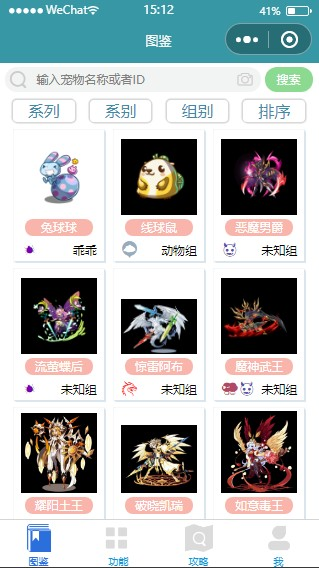

## 目录
[TOC] 

## 项目介绍
&emsp;&emsp;这是一个微信小程序入门实战项目，项目借鉴一些洛克王国的粉丝自主开发维护的《ROCO攻略》小程序。项目只是仿照开发了该小程序的首页以及底部导航栏，手动抓取了其数十条图片资源。

> 《ROCO攻略》导航栏首页截图  

    


## 项目进度
- [ ] 完成了图鉴页面  

- [x] 功能界面
- [x] 攻略界面
- [x] 个人信息界面

## 项目说明
--- 
### 部分无用文件
&emsp;&emsp;项目作为实战训练项目，有很多偏向笔记性质的页面，而且roco攻略模块也是搭建在前期学习小程序员语法的碎片化页面的基础之上，后面这些无关的文件会逐步被剔除。  
&emsp;&emsp;这些文件可以放心删除（从根目录起始）：
1. pages目录
2. component/bar
3. image目录和image目录（markdown）
--- 
### 数据接口规范
- 请求连接：
<http://192.168.153.1:8088/pet/series>
> 该域名在微信小程序中属于不合法域名，需要关闭对域名的校验  

- 返回数据格式样例：  
```json
{
    "data": {
        "series": [
            "系列",
            "奉神",
            "圣域",
            "年费",
            "乐园",
            "节令志",
            "节气志",
            "守护者",
            "精灵王",
            "勇者神祗"
        ],
        "attribute":[...],
        "group":[...],
        "order":[...]
    },
    "pets": [
      {
          "id": 448,
          "name": "兔球球",
          "profile": "media/448.png",
          "attr": "虫系",
          "attr2": null,
          "series": null,
          "group": "乖乖"
      },
      {
          "id": 509,
          "name": "线球鼠",
          "profile": "media/509.jpg",
          "attr": "石系",
          "attr2": null,
          "series": null,
          "group": "动物组"
      },
      ...
    ]
}
```

